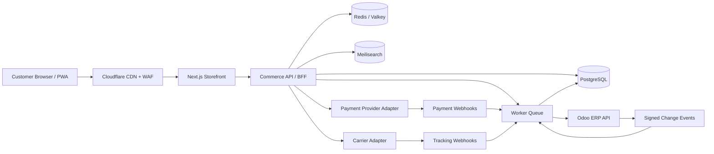
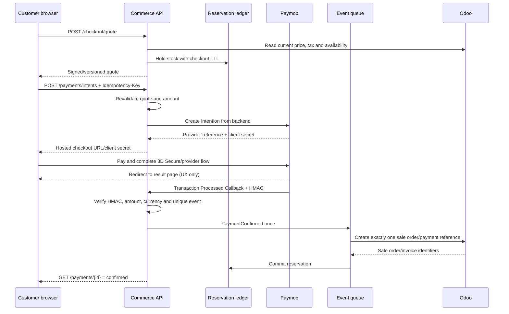

# Egypt Deal — Headless Commerce Rebuild Plan

**Prepared for:** GPT-5.6 Luna implementation agent  
**Date:** 2026-08-15  
**Target:** Replace the Odoo website frontend with a fast, premium, bilingual storefront while keeping Odoo as the ERP source of truth for catalog, price lists, stock, orders, fulfillment, invoices, and customer records.

---

## 0. Executive decision

Build a **composable headless storefront**, not another Odoo theme and not a second independent ERP.

- **Frontend:** Next.js App Router + TypeScript, fully independent from Odoo Website.
- **Commerce/API layer:** NestJS service with PostgreSQL, Redis/Valkey, Meilisearch, and background workers.
- **ERP:** Odoo remains authoritative for products, price lists, physical stock, sales orders, deliveries, invoices, and returns.
- **Data strategy:** The storefront reads from a local projection optimized for speed. It never calls Odoo during normal page rendering. Price and stock are revalidated server-side before order placement.
- **Integration:** Adapter-based Odoo connector, outbound events/webhooks where available, plus incremental polling and nightly reconciliation.
- **Experience:** Arabic-first RTL, complete English mirror, mobile-first, Shopify-grade discovery, rich product pages, one-page checkout, and guest/account order tracking.

This approach preserves existing ERP operations while removing Odoo Website's design, performance, and customization ceiling.

---

## 1. Current-site audit

### What is already valuable

- Recognizable Egypt Deal navy/red identity and logo.
- Arabic and English language support.
- Strong homepage hero, category hub, hot deals, outlet, service benefits, installment messaging, WhatsApp support, and store-location content.
- Large catalog: the current shop reports roughly **770 products**.
- Existing category structure covering electronics, computers, kitchen and large appliances, personal care, medical, tools, baby products, and home essentials.
- Existing Odoo operational data and customer/order workflows should be retained.

### Problems the rebuild must solve

1. **Catalog quality is inconsistent.** The shop mixes Arabic and English, contains duplicated/fragmented categories, and exposes technical/default labels.
2. **Pricing cannot be trusted visually.** Many products show `0.00 LE` while others use “Contact Us.” Zero must never appear as a sellable price.
3. **Product attributes are misconfigured.** A sampled PDP exposed an entire brand list as the selected brand instead of one product brand.
4. **PDPs are too thin.** Single image, limited specifications, little buying guidance, weak cross-sell, and generic default policy copy.
5. **Default promises may be inaccurate.** The current PDP displays generic “30-day money-back guarantee” and “2–3 Business Days” text; these must come from approved business policy, not theme defaults.
6. **Discovery is not premium.** Search, autosuggest, Arabic synonyms, model-number matching, category-specific facets, and comparison need a purpose-built implementation.
7. **Order tracking is not a consumer-grade flow.** Customers need a clear public lookup and a richer account timeline synchronized with Odoo delivery states.
8. **Odoo Website limits frontend velocity.** The desired experience requires a dedicated web stack, independent release cycle, and automated testing.

### Benchmark lessons to adopt

- **Anker:** use-case navigation, global autosuggest, fast checkout, payment options, clear delivery/returns.
- **JB Hi-Fi:** specification-rich PDPs, category-specific filters, autosuggest across products/categories/content, click-and-collect, and buy-now-pay-later.
- **Turtle Beach:** compatibility-led category journeys, video/lifestyle media, comparison, reviews, and accessories.
- **Nanoleaf:** headless performance, guided product selection, rich interactive education.
- **Shokz:** immediate best-seller merchandising and meaningful product comparison.
- **Upscale Audio:** prominent expert help, fixed contact access, and strong online-to-offline trust.

Primary benchmark: [Shopify — 12 Best Consumer Electronics Sites that Convert](https://www.shopify.com/enterprise/blog/consumer-electronics-websites). Search/discovery benchmark: [Shopify Search & Discovery guidance](https://www.shopify.com/blog/how-to-optimize-your-search-and-discovery-experience-on-shopify).

---

## 2. Product vision

> Egypt Deal should feel like the fastest, clearest electronics advisor in Egypt: discover the right product in seconds, trust the real availability and price, choose payment and delivery confidently, then track every step without calling support.

### Design direction

**“Precision retail with Egyptian warmth.”** Deep midnight navy, bright signal red, cool white surfaces, sharp typographic hierarchy, generous spacing, honest product photography, and small moments of motion. The site should feel energetic and commercial without looking like a discount marketplace.

### Primary audiences

1. Mobile-first Egyptian consumers comparing electronics and small appliances.
2. Price-sensitive shoppers looking for hot deals, outlet products, installments, and delivery clarity.
3. Buyers who know a model number and need fast search/specification comparison.
4. Existing customers checking order, delivery, warranty, or pickup status.
5. Egypt Deal staff managing products, stock, fulfillment, and customers in Odoo.

### Goals

- Make every in-stock, sellable product discoverable within three interactions.
- Eliminate visible `0.00` prices and stale availability.
- Achieve p75 Core Web Vitals: LCP ≤ 2.5 s, INP ≤ 200 ms, CLS ≤ 0.10.
- Keep projected inventory freshness under two minutes during normal operation.
- Create every accepted order exactly once in Odoo, even when webhooks retry.
- Let at least 90% of customers view order status without contacting support.
- Preserve all valuable indexed URLs with 301 redirects at launch.

### Non-goals for v1

- Replacing Odoo Inventory, Sales, Accounting, or CRM.
- Building a marketplace for third-party sellers.
- Native iOS/Android apps; the responsive PWA is the v1 mobile product.
- AI-generated prices, stock, or policy answers.
- Loyalty points, subscriptions, and trade-in; architect for them, ship later.

---

## 3. Critical Phase-0 gate: Odoo API eligibility

Odoo's official documentation states that external API access is available only on **Custom** plans, not One App Free or Standard. Before implementation:

1. Record the current Odoo major version and hosting plan.
2. Confirm API access with a least-privilege integration user and a test database clone.
3. If the current plan does not expose the API, choose one of:
   - Upgrade Odoo Online to Custom.
   - Move the database to Odoo.sh.
   - Move to a managed/self-hosted Odoo environment.
4. Do not scrape Odoo web pages or use browser sessions as an integration.

Connector policy:

- Odoo 19+: use the official **JSON-2 API** through `/json/2` with scoped bearer API keys.
- Odoo 18 or earlier: isolate XML-RPC/JSON-RPC inside the Odoo adapter. Do not leak RPC conventions into domain services.
- Plan migration because legacy external RPC endpoints are scheduled for removal in future Odoo releases.

References: [Odoo 19 JSON-2 API](https://www.odoo.com/documentation/19.0/developer/reference/external_api.html), [Odoo 18 External API](https://www.odoo.com/documentation/18.0/developer/reference/external_api.html), [Odoo Webhooks](https://www.odoo.com/documentation/19.0/applications/studio/automated_actions/webhooks.html).

---

## 4. Target architecture



### Recommended stack

| Layer | Choice | Reason |
|---|---|---|
| Web | Next.js App Router, React, TypeScript | SSR/ISR, excellent SEO, image optimization, strong ecosystem |
| UI | Tailwind CSS + Radix primitives + custom design system | Accessible primitives without generic theme styling |
| API | NestJS, REST/OpenAPI, Zod validation | Clear modules, typed contracts, background-job friendly |
| Database | PostgreSQL | Durable storefront projection, carts, events, idempotency, redirects |
| Cache/session | Redis or Valkey | carts, rate limits, short stock cache, queues |
| Search | Meilisearch | fast typo-tolerant Arabic/English search, synonyms, filters |
| Jobs | BullMQ | catalog sync, inventory sync, order export, reconciliation |
| Media | Cloudflare R2 + Images | transformed delivery without serving originals from Odoo |
| CDN/security | Cloudflare | WAF, caching, bot controls, edge redirects |
| Observability | Sentry + OpenTelemetry + structured logs | end-to-end tracing and incident diagnosis |
| Analytics | GA4 + server-side events; PostHog optional | ecommerce funnel plus product behavior |
| Testing | Vitest, Playwright, contract tests, k6 | unit, end-to-end, integration, and load coverage |

### Monorepo layout

```text
egypt-deal/
├── apps/
│   ├── storefront/           # Next.js Arabic/English storefront
│   ├── commerce-api/         # NestJS public/admin API
│   └── integration-worker/   # BullMQ workers and Odoo/carrier/payment adapters
├── packages/
│   ├── design-system/
│   ├── commerce-domain/
│   ├── odoo-adapter/
│   ├── contracts/
│   ├── analytics/
│   └── config/
├── infrastructure/
│   ├── docker/
│   ├── terraform/
│   └── monitoring/
├── docs/
│   ├── adr/
│   ├── api/
│   ├── runbooks/
│   └── migration/
└── tests/
    ├── contract/
    ├── e2e/
    └── load/
```

---

## 5. Source-of-truth matrix

| Domain | Source of truth | Storefront copy | Write direction |
|---|---|---|---|
| Product identity/SKU | Odoo `product.template` / `product.product` | PostgreSQL + search index | Odoo → storefront |
| Categories | Odoo public categories, curated mapping | PostgreSQL | Odoo → storefront; presentation overrides local |
| Arabic/English content | Odoo translations initially | PostgreSQL | Odoo → storefront; optional CMS override later |
| Price/pricelist | Odoo pricelists | PostgreSQL projection | Odoo → storefront; final checkout revalidation |
| On-hand/forecast stock | Odoo Inventory | Redis + PostgreSQL snapshot | Odoo → storefront |
| Cart | Storefront | Redis/PostgreSQL | storefront only until checkout |
| Payment authorization | Payment provider | PostgreSQL + Odoo mirror | provider → storefront → Odoo |
| Sales order | Odoo `sale.order` | PostgreSQL order projection | storefront → Odoo; Odoo → storefront status |
| Fulfillment/tracking | Odoo `stock.picking` + carrier | PostgreSQL timeline | Odoo/carrier → storefront |
| Invoice | Odoo `account.move` | customer-facing link/metadata | Odoo → storefront |
| Customer | Odoo partner master after order | storefront account profile | bidirectional with explicit conflict rules |
| Marketing layout | Storefront CMS/config | Next.js cache | local/admin managed |

No data-sync job may silently overwrite human changes without an ownership rule.

---

## 6. Odoo data mapping

Minimum fields must be confirmed against the real database using `fields_get` or Odoo 19 dynamic `/doc`.

### Catalog

- `product.template`: name, description, sale description, category, public categories, brand custom field, warranty, dimensions, weight, publish status, available-for-sale flag, SEO fields, write date.
- `product.product`: variant ID, SKU/default code, barcode, attribute values, image, active state.
- `product.public.category`: hierarchy, translations, image, website sequence.
- `product.pricelist` and `product.pricelist.item`: currency, customer segment, base price, promotional rules, validity.
- Product media: import original assets once, checksum them, store optimized derivatives outside Odoo.

### Inventory

- `stock.quant`: physical quantity by product/location.
- `stock.warehouse` and internal locations: sellable locations only.
- Use Odoo's business method/approved availability fields for forecasted availability; do not calculate from raw quants if reservations/routes make that incorrect.
- Derive public stock states: `in_stock`, `low_stock`, `preorder`, `out_of_stock`, `contact_to_order`.
- Never expose exact stock quantities publicly unless approved.

### Orders and fulfillment

- `res.partner`: customer and delivery address.
- `sale.order`: external idempotency key, storefront order reference, pricelist, totals, payment state, fulfillment state, source/channel.
- `sale.order.line`: Odoo product variant, quantity, validated unit price, discount, taxes.
- `payment.transaction`: provider reference and verified status when supported by current Odoo payment configuration.
- `stock.picking`: delivery status, scheduled date, carrier/tracking reference.
- `account.move`: invoice number, status, customer document link.

Add custom namespaced fields only when necessary, such as `x_storefront_order_id`, `x_checkout_idempotency_key`, and `x_payment_provider_ref`.

---

## 7. Synchronization design

### 7.1 Initial catalog import

1. Pull in pages by `write_date` and stable Odoo ID.
2. Normalize products/variants, translations, categories, attributes, and price lists.
3. Validate: missing SKU, duplicate SKU, no image, zero price, invalid brand, no category.
4. Quarantine invalid products; do not publish them.
5. Download and checksum images; build WebP/AVIF derivatives.
6. Rebuild search index atomically.
7. Compare source and projection counts and produce an import report.

### 7.2 Incremental catalog sync

- Webhook/change event schedules a sync for the affected record when available.
- Incremental poll every 2–5 minutes by `write_date` is the safety net.
- Nightly full reconciliation detects deleted/archived/missed records.
- Each job stores source ID, source write date, payload hash, status, retry count, and error.

### 7.3 Inventory sync

- Event-driven update on stock moves/reservations where possible.
- Poll sellable availability every 30–60 seconds for active SKUs; less frequently for inactive catalog items.
- Cache public stock for at most two minutes.
- At checkout, revalidate every line with Odoo or an atomic reservation service.
- If stock changed, show a precise cart correction; never place a negative-stock order unless Odoo explicitly allows it.

### 7.4 Order export

1. Customer submits checkout with an idempotency key.
2. Server validates cart, customer, address, price list, stock, shipping, discount, and payment method.
3. Create a local `pending_submission` order and append an outbox event in the same DB transaction.
4. Worker creates/updates the customer and draft sale order in Odoo.
5. For prepaid orders, verify payment webhook signature before confirming the sale order.
6. For COD, confirm according to the approved fraud/confirmation rule.
7. Save Odoo IDs and immutable totals; notify customer.
8. Retry safely. Duplicate requests must return the original order.

### 7.5 Tracking sync

- Map Odoo/carrier states to customer language:
  `order_received → confirmed → preparing → ready_for_pickup / handed_to_carrier → out_for_delivery → delivered`.
- Separate exceptions: `payment_failed`, `address_issue`, `delivery_attempt_failed`, `cancelled`, `returned`.
- Every status change becomes a timestamped event with Arabic and English labels.
- Notifications: transactional email first; WhatsApp/SMS adapters may follow after template/provider approval.

### 7.6 Failure controls

- HMAC signatures and rotating secrets for incoming webhooks.
- Idempotency table with unique keys per provider/event/order.
- Exponential retry with dead-letter queue.
- Circuit breaker around Odoo; storefront remains browsable when Odoo is unavailable.
- Admin integration dashboard: queue depth, last successful sync, stale SKUs, failed orders, reconciliation differences.
- Daily report: product count, stock mismatch count, order mismatch count, last event latency.

---

## 8. Public API contract

### Catalog

```text
GET  /v1/navigation
GET  /v1/categories/:slug
GET  /v1/products/:slug
GET  /v1/products/:slug/recommendations
GET  /v1/search?q=&category=&brand=&attributes=&price=&sort=&page=
POST /v1/compare
```

### Cart and checkout

```text
POST   /v1/carts
GET    /v1/carts/:id
POST   /v1/carts/:id/items
PATCH  /v1/carts/:id/items/:lineId
DELETE /v1/carts/:id/items/:lineId
POST   /v1/carts/:id/coupon
POST   /v1/checkout/quote
POST   /v1/orders                  # Idempotency-Key required
POST   /v1/payments/:provider/session
POST   /v1/webhooks/payments/:provider
```

### Customer and tracking

```text
POST /v1/auth/magic-link
GET  /v1/me/orders
GET  /v1/me/orders/:number
POST /v1/order-lookup              # order number + verified phone/email
GET  /v1/order-lookup/:token
POST /v1/orders/:number/cancel-request
POST /v1/orders/:number/return-request
```

All responses use stable error codes, Arabic/English display messages, request IDs, and OpenAPI documentation.

---

## 9. Information architecture

```text
Homepage (/)
├── Shop (/shop)
│   ├── Category (/c/{category-slug})
│   │   └── Subcategory (/c/{category-slug}/{subcategory-slug})
│   ├── Brand (/brands/{brand-slug})
│   ├── Hot Deals (/hot-deals)
│   ├── Outlet (/outlet)
│   ├── New Arrivals (/new-arrivals)
│   └── Search (/search?q=...)
├── Product (/p/{product-slug})
├── Compare (/compare)
├── Cart (/cart)
├── Checkout (/checkout)
│   └── Confirmation (/order/success/{order-number})
├── Track Order (/track-order)
├── Account (/account)
│   ├── Orders (/account/orders)
│   ├── Order detail (/account/orders/{order-number})
│   ├── Addresses (/account/addresses)
│   ├── Wishlist (/account/wishlist)
│   └── Profile (/account/profile)
├── Buying Guides (/guides)
│   └── Guide (/guides/{slug})
├── Support (/support)
│   ├── Contact (/contact)
│   ├── Delivery (/shipping-policy)
│   ├── Warranty (/warranty)
│   ├── Returns (/returns)
│   └── FAQ (/faq)
├── Store Location (/store-location)
├── About (/about-us)
├── Terms (/terms-conditions)
└── Privacy (/privacy)
```

### Header

- Announcement strip: approved nationwide delivery/offer message.
- Main row: logo, dominant search, account, wishlist, cart, AR/EN switch.
- Primary nav: Shop, Hot Deals, Outlet, Brands, Buying Guides, Track Order.
- Desktop mega menu limited to 3–4 columns; mobile uses drill-down navigation.
- Sticky compact header after scroll; search remains accessible.

### Footer

- Shop: primary categories, hot deals, outlet.
- Help: tracking, delivery, returns, warranty, contact.
- Company: about, store location.
- Legal: terms, privacy.
- Contact details, approved social links, payment methods, and trust marks.

### URL migration

- Export every current Odoo website URL.
- Create an explicit 301 map to the new URL; never rely only on heuristic redirects.
- Preserve query parameters used by paid campaigns.
- Keep legacy product/category redirects indefinitely.

---

## 10. Page requirements

### 10.1 Homepage

- Arabic-first hero with one primary promotion and one secondary CTA.
- Search visible above the fold on mobile and desktop.
- Category rail with real product/lifestyle imagery.
- Hot Deals and Outlet modules with honest price/discount/condition.
- Personalized/merchandised product rows: best sellers, new, kitchen, personal care, recently viewed.
- Installment, nationwide delivery, store pickup, warranty, and support modules.
- Buying-guide teaser and trusted brand rail.
- No slider should hide critical products. Carousels must be keyboard and touch accessible.

### 10.2 Search

- Results after 2 characters, p95 response <150 ms from search service.
- Match Arabic/English names, SKU, model, barcode, brand, category, and synonyms.
- Transliteration/synonym examples: `تكييف/air conditioner/AC`, `قلاية/air fryer`, Arabic numerals/Latin numerals.
- Autosuggest sections: products, categories, brands, recent searches, popular searches.
- Typo tolerance with controllable merchandising rules.
- Zero-results page offers corrections, categories, WhatsApp help, and popular products.

### 10.3 Product listing/category

- SEO intro, breadcrumb, result count, and category art.
- Category-specific facets, not a universal noisy list.
- Sticky desktop filter panel; mobile filter sheet with applied-filter chips.
- Sort: recommended, newest, price low/high, discount, popularity.
- Product card: image, brand, title/model, rating when real, price, old price/discount, stock state, installment, wishlist, compare, quick add where safe.
- `0.00` is forbidden. Missing price displays “Request price” and cannot enter normal checkout.

### 10.4 Product detail page

- 4–8 optimized images when available, zoom, optional video, consistent aspect ratios.
- Brand, title, model/SKU, rating count, stock and location availability.
- Price/discount/installment information with an “as of” data timestamp.
- Variant selection with disabled unavailable combinations.
- Prominent add-to-cart and buy-now; request-price workflow for quote-only products.
- Delivery estimate by governorate and pickup availability.
- Warranty/returns messages drawn from product/category policy fields.
- Key highlights, complete specification table, what is in the box, compatibility, documents.
- Compare, related alternatives, accessories, recently viewed, and verified reviews (P1).
- Structured data: Product, Offer, BreadcrumbList, AggregateRating only when authentic.

### 10.5 Cart

- Persistent guest cart across devices after sign-in.
- Inline quantity/edit/remove, stock revalidation, coupon, delivery threshold progress.
- Cross-sells limited to genuinely compatible accessories.
- Clear subtotal, discount, shipping estimate, taxes, and grand total.
- Never surprise the customer with unannounced costs.

### 10.6 Checkout

- Guest checkout default; optional account/magic-link.
- One-page progressive sections: contact → delivery/pickup → payment → review.
- Egypt-aware phone validation and governorate/area address model.
- Address autocomplete only with user consent and reliable Egyptian coverage.
- Payment adapters: COD, cards/Paymob, installment providers as approved.
- Server revalidates price and stock immediately before placement.
- Accessible errors retain all valid entered data.
- Double-click/retry cannot create duplicate Odoo orders.

### 10.7 Order tracking

- Public lookup by order number plus verified phone/email challenge.
- Visual timeline with customer-friendly status, last update, products, total, delivery/pickup details, tracking link, invoice when available.
- Clear exception handling and contact action.
- Account customers see full order history and can request cancellation/return according to policy.

---

## 11. Functional priorities

### P0 — launch-blocking

- Bilingual AR/EN with real RTL/LTR components and localized metadata.
- Odoo catalog, price, stock, order, delivery, and customer integration.
- Search/autosuggest, category facets, PLP, PDP, cart, guest checkout.
- At least one production payment flow plus COD if approved.
- Order confirmation and guest/account tracking.
- Product publishing validation and zero-price protection.
- Admin integration health screen and dead-letter handling.
- SEO migration, sitemaps, canonical/hreflang, schema, redirects.
- Accessibility WCAG 2.2 AA for core shopping flows.
- Core analytics funnel and consent mechanism.
- Automated test suite and operational runbooks.

### P1 — first 30 days

- Product comparison for up to four items.
- Wishlist and back-in-stock notifications.
- Verified reviews and Q&A moderation.
- Buying guides and contextual recommendations.
- Store pickup inventory/status.
- WhatsApp transactional notifications after provider/template approval.
- Returns/cancellation request workflows.
- Merchandising console for boosts, banners, synonyms, and recommendation pins.

### P2 — later

- Loyalty/rewards and referrals.
- Trade-in and refurbished grading.
- AI shopping assistant grounded only in approved product data.
- PWA push notifications.
- B2B pricing/account portal.
- Multiple branches and branch-aware inventory selection.

---

## 12. Key user stories and acceptance criteria

### Discovery

**As a model-number shopper, I want to find the exact product immediately.**

- Given an Arabic or English query, search returns relevant products/categories/brands after two characters.
- SKU/model/barcode exact matches rank first.
- Unavailable products are clearly labeled and do not outrank sellable equivalents without a merchandising rule.
- Empty results never render a blank page.

### Product confidence

**As a buyer, I want accurate price, availability, warranty, and specifications before I pay.**

- No published sellable product displays `0.00`.
- Brand is one valid brand, not the complete attribute option list.
- Policy copy is sourced from approved product/category settings.
- Price/stock changes detected at checkout produce a clear correction before payment.

### Checkout

**As a guest, I want to complete an order on mobile without creating an account.**

- Core checkout completes on a 360 px viewport without horizontal scrolling.
- Form errors focus and explain the invalid field in Arabic or English.
- Retrying the final request returns the same order rather than creating another.
- Payment success is accepted only from a verified provider webhook/status check.

### Tracking

**As a customer, I want to know where my order is without calling.**

- Valid order + verified contact reveals the timeline.
- Invalid lookup does not reveal whether another customer's order exists.
- Odoo delivery changes appear within two minutes under normal conditions.
- Failed/exception states provide the correct support action.

### Operations

**As an operator, I need every storefront order in Odoo exactly once.**

- Each order has one stable storefront ID and one Odoo sale order ID.
- Retries are idempotent.
- Failed exports are visible, retryable, and alerted.
- Daily reconciliation identifies missing or mismatched orders.

---

## 13. Design system handoff

### Tokens

```css
--ink-950: #07183f;
--ink-900: #0d2458;
--ink-700: #24447f;
--signal-600: #e3262e;
--signal-700: #bd1820;
--blue-500: #2f73ef;
--sky-100: #eaf2ff;
--canvas: #f6f8fc;
--surface: #ffffff;
--line: #dbe4f2;
--success: #0d9b67;
--warning: #d77608;
--danger: #c9212a;
--radius-sm: 10px;
--radius-md: 16px;
--radius-lg: 24px;
--shadow-card: 0 14px 40px rgba(13,36,88,.09);
```

### Typography

- Arabic display/body: **Alexandria** or **Noto Kufi Arabic** after performance/legibility testing.
- English: **Manrope**.
- Use tabular numerals for prices and order references.
- Minimum body size 16 px; product metadata 13–14 px; do not use low-contrast gray.

### Layout

- Content max width: 1440 px, 24 px desktop gutters, 16 px mobile.
- 12-column desktop grid, 8 tablet, 4 mobile.
- Product media uses 1:1 canvas; lifestyle modules may use 4:3/16:9.
- Product cards align title, pricing, and actions even with variable title length.

### Motion

- One restrained page-entry sequence, 180–280 ms component transitions.
- Respect `prefers-reduced-motion`.
- Do not autoplay homepage carousels or video with sound.

### Accessibility

- WCAG 2.2 AA color contrast and focus states.
- Full keyboard operation for nav, search, filters, gallery, comparison, cart, and checkout.
- Arabic screen-reader labels; direction set at document and component level.
- Touch targets at least 44×44 px.

### Arabic/English localization contract

- Every public, client, and staff-admin route ships in both `ar-EG` and `en-EG`; Arabic is the default storefront locale, while each user profile persists its last language choice.
- Switching locale changes copy, document `lang`, document `dir`, navigation order, directional icons, table alignment, form labels, validation messages, notifications, emails, invoices, and printable documents. It must not merely translate the current heading.
- Use reviewed message catalogs, not runtime machine translation. UI copy keys are shared across web, transactional email, notification, and support surfaces, with separate locale-specific editorial fields for product and campaign content.
- Brand names, model names, SKUs, order IDs, payment references, API names, and regulated provider names remain unchanged. Surround embedded LTR identifiers with direction isolation so mixed content remains readable.
- Currency is EGP in both locales. Display Arabic UI amounts as `3,499 ج.م` and English UI amounts as `EGP 3,499`; store money as integer piastres and format server-side or with a shared locale utility.
- Search uses Arabic normalization and English tokenization, with bilingual synonyms, transliteration support, typo tolerance, and analytics for zero-result queries by locale.
- CMS publishing requires both locale variants for navigation, categories, campaign banners, buying guides, SEO title, meta description, image alt text, and structured-content fields before a page can be marked complete.
- Components must be direction-safe: use CSS logical properties, mirrored previous/next controls, locale-aware chevrons, and visual regression baselines for both directions at desktop and mobile widths.
- Automated tests must traverse the full purchase, account, tracking, admin, marketplace, and payment flows in both locales. The gate fails for missing keys, fallback keys exposed to users, mixed-language labels, clipped Arabic text, or untranslated validation/error states.

---

## 14. SEO and content

- Locale routes: Arabic default without prefix, English under `/en`; confirm strategy before launch and keep it stable.
- `hreflang`: `ar-EG`, `en-EG`, and `x-default`.
- Unique Arabic/English title, H1, meta description, and canonical for every indexable page.
- Product/category XML sitemaps generated from the storefront projection.
- JSON-LD: Organization, WebSite/SearchAction, BreadcrumbList, Product/Offer, FAQ only where valid.
- No indexing of filtered faceted URLs unless explicitly curated.
- Guides target high-intent questions: choosing AC capacity, air fryer size, washing machine type, headphone compatibility, power-bank capacity.
- Product content governance: required fields, prohibited unsupported claims, image/spec completeness score.

---

## 15. Analytics

Track both client and server events with a shared event schema:

- `view_item_list`, `select_item`, `view_item`, `search`, `filter_applied`.
- `add_to_wishlist`, `add_to_compare`, `add_to_cart`, `remove_from_cart`.
- `begin_checkout`, `add_shipping_info`, `add_payment_info`, `purchase`.
- `order_lookup`, `order_status_view`, `contact_whatsapp`.
- Business dimensions: Odoo product ID, SKU, category path, brand, stock state, price type, language, device, acquisition source.

Never send email, phone, address, or unredacted order/customer IDs to analytics.

### Success dashboard

- Conversion rate by device/language/channel.
- Search usage, search conversion, zero-result rate.
- Product-view → cart and cart → checkout conversion.
- Checkout error and abandonment step.
- Odoo sync freshness and failed-order count.
- Support-contact rate per 100 orders.

---

## 16. Security and compliance

- Secrets only in a managed secret store; never `NEXT_PUBLIC_*`.
- Least-privilege Odoo integration user; read catalog/inventory, write only required sales/customer/payment fields.
- WAF, rate limiting, bot controls, CSRF protection, strict input validation.
- Verified payment/carrier/Odoo webhook signatures with replay protection.
- Never store raw card data; use provider-hosted/tokenized payment components.
- Encrypt sensitive fields at rest where appropriate; define retention and deletion policies.
- Audit log for order state changes, refunds, admin merchandising, integration retries.
- Privacy/terms/returns/warranty copy must be legally reviewed before launch.

---

## 17. Quality gates

### Automated

- Unit tests for pricing, availability, cart, discount, state mapping, translations.
- Contract tests against an Odoo test database and payment sandbox.
- Playwright E2E for Arabic and English: search → PDP → cart → checkout → tracking.
- Visual regression at 360, 768, 1024, 1440 px.
- Accessibility scans plus manual keyboard/screen-reader pass.
- k6 load test: browse, search, add-to-cart, checkout quote, order lookup.
- Dependency, secret, and container scans.

### Launch SLOs

- Storefront/API availability: 99.9% monthly.
- Search p95 <150 ms excluding network.
- Catalog page API p95 <300 ms.
- Checkout quote p95 <1.5 s when Odoo healthy.
- Normal stock/order status staleness <2 minutes.
- Zero duplicate orders in all retry/timeout chaos tests.

---

## 18. Delivery plan

### Phase 0 — integration proof (2–4 days)

- Confirm Odoo plan/version/API and clone test database.
- Prove reads for one product, category, price, availability, order, and picking.
- Prove a safe draft order creation and idempotent retry.
- Document exact field mapping and access rights.
- **Exit:** written integration ADR and green spike tests. Stop if API eligibility is unresolved.

### Phase 1 — foundation (week 1)

- Monorepo, CI/CD, environments, secrets, observability.
- Design tokens/components, locale/RTL foundation, accessibility baseline.
- PostgreSQL schema, Redis, Meilisearch, API contracts.

### Phase 2 — catalog and discovery (weeks 2–3)

- Full/incremental Odoo sync, validation/quarantine, image pipeline.
- Navigation, category taxonomy, search/synonyms/facets.
- Homepage, PLP, search, redirects, SEO foundation.

### Phase 3 — PDP and cart (weeks 4–5)

- Rich product model and PDP.
- Variants, availability, installments/policy messaging, compare.
- Persistent cart, stock/price revalidation, coupons.

### Phase 4 — checkout and payments (weeks 6–7)

- Egypt address model, delivery/pickup, quote endpoint.
- Introduce a gateway-neutral `PaymentGateway` boundary with Paymob as the primary online PSP, COD as an internal operational method, and BNPL/installments enabled only from merchant capabilities.
- Integrate Paymob's current Intention API from the backend and launch Unified Checkout first; evaluate Pixel only after hosted checkout is production-stable.
- Verify Paymob transaction-processed callbacks with HMAC, deduplicate events, and treat backend callbacks—not the browser redirect—as payment truth.
- Build idempotent order export, confirmation, refund/void controls, COD verification, provider capability discovery, settlement import, and four-way reconciliation.
- Complete sandbox, 3D Secure, duplicate/out-of-order callback, partial-refund, provider-timeout, and amount-tampering tests before a limited live-payment canary.
- **Exit:** card, enabled wallet, one enabled BNPL route, and COD each complete their approved lifecycle without duplicate Odoo orders; refunds and settlements reconcile with evidence.

### Phase 5 — account and tracking (week 8)

- Magic-link authentication, account orders, guest lookup.
- Odoo picking/carrier timeline, notifications, invoice link.

### Phase 6 — hardening and migration (weeks 9–10)

- Content migration, URL redirects, accessibility/performance/load/security testing.
- Parallel inventory/order reconciliation.
- Staff training, incident runbooks, launch rehearsal, rollback.

### Phase 7 — Amazon and noon channels (weeks 11–12)

- Complete seller-account authorization and capability spikes for Amazon Egypt SP-API and the noon Egypt Partner API project.
- Build the shared marketplace adapter, listing mappings, available-to-promise allocation, price guardrails, order ingestion, fulfillment updates, returns, and settlement reconciliation.
- Run each channel in shadow mode, then stock-only canary, then limited-SKU order canary before expanding the catalog.
- **Exit:** listings, quantities, prices, orders, cancellations, fulfillment, returns, and settlements reconcile with Odoo under duplicate, delayed, throttled, and out-of-order event tests.

**Estimate:** 12 weeks for a focused multi-disciplinary team; 15–19 weeks for one strong full-stack engineer. Phase 1 begins only after the Phase 0 integration proof passes. Marketplace go-live begins only after the first-party storefront and Odoo order path are stable.

---

## 19. Go-live strategy

1. Run catalog/stock sync in shadow mode and compare with Odoo daily.
2. Create test orders in a non-production Odoo database.
3. Production dark launch behind staff authentication.
4. Limited traffic/canary, then progressive DNS/CDN cutover.
5. Keep Odoo Website on a non-public fallback subdomain during stabilization.
6. Verify redirects, analytics, payment, order creation, picking updates, emails, and tracking.
7. Rollback switches domain routing only; never delete new orders or reverse them automatically.

---

## 20. Blocking decisions for the owner

These should not block Phase 0 research but must be resolved before checkout implementation:

1. Odoo version, plan, and API eligibility.
2. Which stock locations are publicly sellable.
3. Price rule: public price, request-price, or customer-specific price for each product.
4. Paymob merchant account status, KYC approval, live/test credentials, enabled integration IDs, checkout experience, settlement schedule, and account owner.
5. Approved delivery carriers, governorates, fees, ETA rules, and free-shipping exceptions.
6. Official returns, warranty, cancellation, and outlet-condition policies.
7. Whether store pickup reserves inventory immediately.
8. Arabic/English content ownership and review process.
9. Production hosting/region and operational owner.
10. Amazon Egypt Professional seller account, Developer Central private-app approval, target merchant-fulfillment model, and requested SP-API roles.
11. noon Egypt Partner account/project, FBPI versus FBN decision, integration warehouse, service-account/OAuth ownership, and Content API entitlement.
12. Per-channel commercial rules: price markup, minimum margin, stock cap/buffer, promotions, returns, fulfillment SLA, and finance settlement owner.
13. Approved first-party payment methods: cards, each mobile wallet, each BNPL/installment provider, COD, saved cards, authorization/capture, and any payment-link use case. Never assume a method is enabled because Paymob supports it generally.
14. COD policy: eligible governorates/carriers, maximum basket, phone verification, fraud thresholds, refusal/blacklist rules, cash-remittance SLA, and responsible team.
15. Refund/void/chargeback authority matrix, four-eyes thresholds, accounting treatment, fee schedule, and daily reconciliation owner.

---

## 21. Definition of done

- [ ] Odoo is the verified source of truth and API credentials are least privilege.
- [ ] All published products pass SKU/category/image/brand/price-state validation.
- [ ] Arabic/English pages and metadata are complete; no mixed UI labels.
- [ ] Search, facets, PDP, cart, checkout, confirmation, account, and tracking meet acceptance criteria.
- [ ] Payment/order retries cannot duplicate an Odoo order.
- [ ] Client totals are repriced server-side; Paymob intentions use the immutable quoted amount in the smallest currency unit.
- [ ] Paymob transaction callbacks pass HMAC validation and event deduplication; a success redirect alone can never mark an order paid.
- [ ] Hosted payment components keep PAN/CVV outside Egypt Deal systems, and logs contain no secret keys or sensitive payment data.
- [ ] Only methods actually enabled for the Paymob merchant account are displayed; BNPL terms and eligibility come from the provider response.
- [ ] COD orders remain unpaid until carrier cash remittance is reconciled; phone verification and risk limits are enforced.
- [ ] Full/partial refunds, eligible voids, settlement fees, chargebacks, Odoo credit notes, and bank/carrier remittances are traceable and reconciled.
- [ ] Stock and tracking reconcile under normal and failure conditions.
- [ ] No visible `0.00` price, incorrect brand list, or unsupported default policy promise.
- [ ] 301 map covers all valuable Odoo URLs.
- [ ] Core Web Vitals, accessibility, security, load, and E2E gates pass.
- [ ] Dashboards, alerts, runbooks, backup, rollback, and staff training are complete.
- [ ] A production test order completes from search to delivered tracking status.
- [ ] Amazon and noon listing mappings are complete for the launch assortment; invalid or unmapped SKUs cannot publish.
- [ ] Channel inventory allocation prevents overselling when web, Amazon, and noon orders arrive concurrently.
- [ ] Amazon `ORDER_CHANGE` and noon webhook duplicates/delays are idempotent and covered by scheduled reconciliation.
- [ ] A canary order on Amazon Egypt and a canary order on noon Egypt each reaches Odoo, fulfillment, shipment, return/refund, and settlement reconciliation successfully.

---

## 22. Exact handoff prompt for GPT-5.6 Luna

```text
You are the lead architect and implementation agent for the Egypt Deal headless commerce rebuild.

Read this document and the accompanying egypt-deal-commerce-mockups.html completely before writing code. Treat Odoo as the authoritative ERP for products, pricelists, sellable stock, sale orders, fulfillment, invoices, and customer records. The public website must be fully independent of Odoo Website.

The interactive mockup is a 27-screen product system, not only a storefront. Implement all three surfaces: the Arabic-first storefront, the authenticated client portal, and the role-protected staff admin console. The client portal must use the same projected order and payment truth as tracking. The admin console must expose operational controls, audit trails, Odoo integration health, queue/DLQ recovery, catalog quality, inventory reconciliation, merchandising, customers, analytics, dedicated Amazon/noon channel operations, and complete Paymob/COD/BNPL/refund/reconciliation operations. Do not give staff direct database access as a substitute for admin workflows.

Start with Phase 0 only:
1. Identify the Odoo version, hosting plan, and supported external API.
2. Prove least-privilege catalog/price/availability reads and idempotent draft-order creation against a test database.
3. Inspect the actual model fields instead of assuming standard/custom names.
4. Write an ADR for the connector and an explicit source-of-truth map.
5. Do not build checkout until the integration spike passes.

Then implement phases in order with tests first. Maintain Arabic-first RTL and a full English mirror from the first component. Do not copy Shopify visuals; match the interaction quality using the Egypt Deal brand system. Never display zero price, infer stock, trust client totals, or create an order without an idempotency key. Never use browser scraping or Odoo session cookies as an integration. Do not hard-code policy, carrier, payment, or installment promises.

For first-party payments, implement a provider-neutral gateway and use Paymob's Intention API from the backend. Launch with Unified Checkout unless the approved UX/security decision selects Pixel. The signed transaction-processed callback is the source of truth; the browser return is presentation only. Do not handle PAN/CVV, expose keys, infer BNPL eligibility, show merchant-disabled methods, mark COD as prepaid, or combine Amazon/noon marketplace settlements with Egypt Deal checkout payment state.

For each phase:
- Write the implementation plan and acceptance tests.
- Build production code, migrations, API contracts, and runbooks.
- Run unit, contract, E2E, accessibility, visual, security, and performance gates appropriate to the phase.
- Report evidence against every exit criterion before proceeding.

The project is complete only when the Definition of Done in this plan is fully checked and a production-like order succeeds end-to-end through Odoo tracking.
```

---

## 23. Mockup reference

Open `egypt-deal-commerce-mockups.html` beside this plan. It is a responsive, interactive 27-screen experience board with a desktop/mobile switch.

### Storefront (6 screens)

1. Homepage and merchandising rails.
2. Search overlay and suggestions.
3. Product listing, filters, and sorting.
4. Product detail, availability, finance, and trust content.
5. Checkout, delivery, payment, and final order summary.
6. Guest order lookup and tracking timeline.

### Authenticated client portal (6 screens)

7. Account overview with current-order status, useful counts, and quick actions.
8. Order history with status filters, search, invoices, re-order, and tracking actions.
9. Full order detail with projected Odoo timeline, line items, payment, invoice, and delivery data.
10. Wishlist with stock and price-change indicators.
11. Profile, verified contact data, addresses, notification preferences, language, and security.
12. Returns, warranty, and support center linked to the original order and invoice.

### Staff admin console (8 screens)

13. Operations overview with reconciled commerce KPIs, sales chart, alerts, and recent orders.
14. Order management with filters, payment/fulfillment/Odoo status, manual orders, export, and bulk operations.
15. Catalog quality with publish readiness, Arabic copy, image, price, taxonomy, and mapping issues.
16. Inventory control with locations, reservations, safety stock, stale data, and Odoo mismatch handling.
17. Odoo integration control center with connector health, queue depth, retries, DLQ, topology, and reconciliation.
18. Merchandising/CMS composition with AR/EN variants, section ordering, rules, scheduling, preview, and publishing.
19. Customer directory with order/service context, consent-safe export, PII audit expectations, and risk indicators.
20. Commerce analytics with reconciled revenue, funnel, device mix, product performance, and zero-result search intelligence.

### Marketplace channel operations (3 screens)

21. Omnichannel marketplace hub with Amazon/noon health, cross-channel revenue/orders, available-to-promise allocation, guardrails, and recent marketplace orders.
22. Amazon Egypt SP-API console with Listings Items/JSON feed state, ASIN mapping, published stock, Orders API ingestion, `ORDER_CHANGE`, account readiness, and feed/notification activity.
23. noon Egypt Partner API console with bilingual content/QC, `partner_sku` and `sku_parent` mapping, pricing/offers, absolute stock by FBPI warehouse, orders/AWB, returns, webhook events, and onboarding readiness.

### Payment operations (4 screens)

24. Payments command center with captured value, success rate, pending exceptions, method health, authoritative callback flow, safeguards, and transaction-to-Odoo linkage.
25. Paymob connector with Intention API status, hosted/embedded checkout capability, merchant-enabled cards/wallets/BNPL, HMAC callback health, keys-in-vault readiness, refunds/voids, and event activity.
26. BNPL/installment and COD policy with live provider eligibility, checkout display controls, phone verification, governorate/carrier eligibility, basket/risk thresholds, and manual review.
27. Finance reconciliation with payment-intent, provider-transaction, Odoo-invoice, bank/carrier-settlement matching; refund approvals, COD remittance, fee variances, chargebacks, and daily close evidence.

### Implementation rules implied by the mockups

- Portal and admin routes require separate shells, authorization boundaries, and session policies.
- Admin access is RBAC-based: support, catalog, fulfillment, marketing, finance, and super-admin permissions are distinct.
- Sensitive admin actions require an audit event; destructive or financial actions require confirmation and, where appropriate, four-eyes approval.
- Tables need server-side pagination, filtering, sorting, saved views, exports, loading/empty/error states, and accessible keyboard behavior.
- Every integration warning must expose a safe recovery path: retry, inspect payload metadata, reconcile, or follow a runbook. Never expose secrets or raw customer PII in logs.
- Client-visible status is a stable projection of internal Odoo/carrier events, not a direct dump of ERP state names.
- All 27 screens must work in Arabic RTL and English LTR. The mockup shows the intended hierarchy; production must add full localization and state coverage.

The mockups define hierarchy, interaction intent, density, and operational safeguards—not final marketing photography, literal production copy, or permission to hard-code sample values.

---

## 24. Amazon Egypt and noon Egypt marketplace architecture

### 24.1 Architecture decision

**Status:** Proposed pending seller-account authorization and sandbox/capability spikes.

Build a first-party `MarketplaceGateway` bounded context inside the commerce platform. It owns channel mappings, safe stock/price projections, external-order ingestion, fulfillment commands, event deduplication, and settlement reconciliation. Odoo remains the operational source of truth; Amazon and noon are sales channels, never parallel masters.

Use only official APIs:

- Amazon: [Selling Partner API (SP-API)](https://sell.amazon.com/developers), not Product Advertising API and not Seller Central scraping.
- noon: [noon Partner API](https://noon-docs.noonpartners.dev/docs/content/content-api), not browser automation or spreadsheet scraping.

Implement one common domain interface with channel-specific adapters. Do not force Amazon and noon payloads into one lowest-common-denominator schema; preserve raw channel metadata behind the adapter for debugging and compliance.

```ts
interface MarketplaceAdapter {
  verifyConnection(): Promise<ConnectionHealth>;
  discoverCapabilities(): Promise<MarketplaceCapabilities>;
  upsertListings(batch: ListingProjection[]): Promise<PublicationResult[]>;
  publishPrices(batch: PriceProjection[]): Promise<PublicationResult[]>;
  publishStock(batch: StockProjection[]): Promise<PublicationResult[]>;
  pullOrders(cursor: SyncCursor): Promise<MarketplaceOrderPage>;
  acknowledgeOrder(order: MarketplaceOrder): Promise<void>;
  createShipment(command: ShipmentCommand): Promise<ShipmentResult>;
  cancelOrRefund(command: ResolutionCommand): Promise<ResolutionResult>;
  pullSettlements(cursor: SyncCursor): Promise<SettlementPage>;
  reconcile(scope: ReconciliationScope): Promise<ReconciliationReport>;
}
```

### 24.2 Source-of-truth rules

| Domain | Master | Channel behavior |
|---|---|---|
| Internal SKU/product/variant | Odoo | Mapped to Amazon seller SKU/ASIN and noon `partner_sku`/`sku_parent` |
| Base price and tax inputs | Odoo | Channel price calculated by approved markup, margin, fee, and promotion rules |
| Physical stock | Odoo | Marketplace receives channel-specific available-to-promise quantity only |
| Channel listing/QC/buyability | Marketplace | Mirrored locally with issues and last-confirmed timestamp |
| Channel order identity | Marketplace | Imported once, reserved centrally, and represented by one Odoo sales order |
| Picking/invoice/internal fulfillment | Odoo | Projected back into the marketplace-specific fulfillment state machine |
| Carrier/AWB for marketplace fulfillment | Marketplace or approved carrier | Stored locally and linked to Odoo picking |
| Returns/refunds | Marketplace initiates; Odoo records operational/financial consequence | Reconciled bidirectionally with immutable audit trail |
| Fees/payouts/settlements | Marketplace | Imported for finance reconciliation; never treated as product-price truth |

### 24.3 Core data model

Add these entities in PostgreSQL with immutable external identifiers and auditable state transitions:

- `marketplace_accounts`: channel, country/marketplace, seller/project identifier, fulfillment model, capabilities, encrypted credential reference, connection status.
- `marketplace_listings`: account, product variant, external seller SKU, ASIN or `sku_parent`, content/QC state, buyability, remote revision, last confirmed timestamp.
- `marketplace_listing_issues`: listing, severity, code, locale, message, first/last seen, resolution state.
- `marketplace_price_rules`: account/category/SKU scope, markup, floor price, minimum margin, sale window, rounding rule, approval state.
- `marketplace_stock_policies`: account/location/SKU scope, safety buffer, channel cap, allocation priority, emergency stop.
- `marketplace_publications`: idempotency key, publication type, request fingerprint, remote job/feed ID, accepted/rejected counts, status, retry metadata.
- `marketplace_orders`: channel account, external order ID, Odoo sale-order ID, normalized state, raw state, totals, fulfillment deadline, idempotency key.
- `marketplace_order_lines`: external line ID, internal variant, quantity, channel price/fees/tax, reservation ID.
- `marketplace_shipments`: order, Odoo picking, AWB, label reference, handover/manifest state, carrier events.
- `marketplace_events`: channel, external message ID, type, schema version, received/processed timestamps, payload hash, status, error class. Unique `(channel, account_id, external_message_id)`.
- `marketplace_settlements`: payout/statement identity, period, gross, fees, refunds, taxes, net, currency, reconciliation state.
- `marketplace_reconciliations`: scope, local snapshot hash, remote snapshot hash, differences, repair action, approver, timestamps.

Never store marketplace private keys, LWA refresh tokens, or noon service-account JSON directly in these rows. Store only a secret-manager reference and rotation metadata.

### 24.4 Shared stock allocation and oversell prevention

Never copy the same Odoo available quantity to the website, Amazon, and noon. A centralized `InventoryAllocator` publishes controlled quantities:

```text
physical_available = max(0, odoo_on_hand - odoo_reserved - unposted_channel_holds)
protected_available = max(0, physical_available - global_safety_stock)
published(channel, sku) = min(channel_cap, allocation(channel, protected_available))
```

Rules:

1. An incoming channel order creates an atomic local reservation before the Odoo push.
2. The allocator immediately recalculates every channel projection and queues absolute stock publications.
3. If Odoo order creation fails, keep the reservation during bounded retries; release only through an audited compensating action.
4. When available stock reaches zero, publish zero to every marketplace with high-priority queues.
5. Periodically compare remote published quantities with the latest intended projections and repair drift.
6. Support per-channel caps, safety buffers, allocation priority, warehouse mapping, and an emergency global stop.
7. Concurrency tests must prove no oversell when web, Amazon, and noon accept the last unit simultaneously.

### 24.5 Normalized order state machine

```text
RECEIVED → VALIDATED → RESERVED → ODOO_CREATED → ACKNOWLEDGED
         → PICKING → PACKED → HANDED_OVER → SHIPPED → DELIVERED
         ↘ ON_HOLD / CANCEL_REQUESTED / CANCELLED / RETURNED / REFUNDED
```

- Preserve each marketplace's raw state alongside the normalized state.
- Every transition is monotonic unless a documented compensating transition exists.
- Out-of-order events are stored but cannot regress the normalized state.
- Unique `(marketplace_account_id, external_order_id)` prevents duplicate orders.
- A marketplace acknowledgment must not happen until reservation succeeds and the local order is durable.
- Odoo creation uses the same idempotent command pattern as website checkout and includes channel, marketplace order ID, marketplace account, external line IDs, channel fees, and fulfillment SLA.

### 24.6 Amazon Egypt implementation

Use a private seller SP-API application. Amazon Egypt is served by the EU SP-API endpoint `https://sellingpartnerapi-eu.amazon.com` in `eu-west-1`, per Amazon's [endpoint documentation](https://developer-docs.amazon.com/sp-api/lang-es_ES/docs/sp-api-endpoints?ld=ASXXSPAPIDirect).

Minimum intended capabilities:

- Authentication: Login with Amazon authorization; refresh token and app credentials stored in the vault. Complete Seller Central Developer Central approval first.
- Roles: Product Listing plus Inventory and Order Tracking. Request restricted roles only when a verified fulfillment requirement needs PII.
- Listings: Product Type Definitions, Catalog Items, Listings Items, and `JSON_LISTINGS_FEED` for bulk updates. Use Amazon's [listing lifecycle guidance](https://developer-docs.amazon.com/sp-api/lang-en_EN/docs/manage-product-listings-guide).
- Orders: use the current [Orders API](https://developer-docs.amazon.com/sp-api/docs/orders-api?ld=ASXXSPAPIDirect&pageName=US%3ASPDS%3ASPAPI-amazon-business), with version pinned in configuration and contract tests.
- Events: subscribe to current `ORDER_CHANGE`; route through SQS or EventBridge and keep a scheduled Orders/Reports reconciliation fallback. Follow Amazon's [ORDER_CHANGE tutorial](https://developer-docs.amazon.com/sp-api/lang-en_EN/docs/tutorial-subscribe-to-order-change-notification).
- Listing health: ingest buyability/discoverability and listing issue notifications; fetch current details when an issue/status notification arrives.
- Bulk jobs: retain feed ID, processing report, accepted/rejected SKU counts, and actionable per-SKU issues.
- Throttling: use per-operation token buckets, respect returned rate-limit headers when present, jittered backoff for `429/5xx`, and circuit breakers.
- Fulfillment: scope Phase 7 first to the approved merchant-fulfilled/Easy Ship model. Treat FBA as a separate capability and stock source, not a flag on merchant-fulfilled logic.
- Finance: import settlements/financial events into a reconciliation ledger; finance approves discrepancies and refunds.

Amazon launch gates:

1. Developer profile and private app approved.
2. Required roles granted with least privilege.
3. Egypt marketplace identifier and merchant-fulfillment workflow verified in sandbox/test orders.
4. Twenty mapped SKUs pass listing, price, quantity, issue, and buyability checks.
5. `ORDER_CHANGE` duplicate, cancellation-request, delayed-message, and outage-recovery tests pass.
6. One limited-SKU canary order completes through Odoo, shipment confirmation, cancellation/return, refund, and settlement.

### 24.7 noon Egypt implementation

Use the official noon Partner API. For one owned seller account, begin with a least-privilege service account; use noon OAuth if the integration will manage seller projects on behalf of multiple sellers. noon documents service-account key handling and signed JWT login in its [authentication guide](https://noon-docs.noonpartners.dev/docs/authentication/authenticating-requests).

Capabilities:

- Content/QC: bilingual Arabic/English attributes, category requirements, image review, completeness, and QC state using the [Content API](https://noon-docs.noonpartners.dev/docs/content/content-api) where enabled for the Egypt project.
- Pricing/offers: publish guarded marketplace prices and inspect offer/live state.
- Inventory: absolute available quantities per `partner_sku` and warehouse using the [Stock API](https://noon-docs.noonpartners.dev/docs/stock/stock-intro). Do not send deltas; noon reserves order quantities itself.
- Fulfillment: for FBPI, configure an integration warehouse and HTTPS webhook; receive order events, retrieve details, create shipment/AWB, print labels, and follow the required pickup manifest process. Use noon's [FBPI model documentation](https://noon-docs.noonpartners.dev/docs/fbpi/what-is-fbpi).
- Events: use [Event Notifications](https://noon-docs.noonpartners.dev/docs/event-notifications/event-notifications), deduplicate by `metadata.message_id`, accept delayed/out-of-order/duplicate delivery, and expose webhook logs. noon documents at-least-once delivery and automatic retry behavior.
- Returns: ingest return-reference events and create linked Odoo return/refund operations through an auditable workflow.
- Rate limits: rate-limit per noon project and endpoint, smooth bursts, honor `429`, and use jittered exponential backoff; see noon's [rate-limit guidance](https://noon-docs.noonpartners.dev/docs/overview/rate-limiting).

Capability caveat: noon's public Content API describes programmatic product creation/update, while current FBPI guidance can require products to be listed in Seller Lab depending on the fulfillment/project setup. Phase 7 must run `discoverCapabilities()` against the real Egypt project and record the result. If product creation is not enabled, use an approved portal onboarding workflow and continue API automation for content status, offers, pricing, stock, orders, and fulfillment. Never scrape Seller Lab.

noon launch gates:

1. Partner project and service-account/OAuth ownership confirmed; key rotation and IP policy documented.
2. FBPI/FBN model and integration warehouse approved.
3. Content creation entitlement and Egypt category coverage proven with real capability tests.
4. Twenty PSKUs map cleanly to internal variants; Arabic and English completeness/QC are visible.
5. Absolute stock, price guardrail, webhook duplicate, 429, delayed event, AWB, manifest, cancellation, return, and RTO tests pass.
6. One limited-SKU canary order completes through Odoo, pick/pack, AWB, manifest/pickup, delivery, return/refund, and settlement.

### 24.8 Failure handling and observability

| Failure | Required behavior |
|---|---|
| Marketplace unavailable | Queue durable command, apply circuit breaker, retain desired state, alert on SLA breach |
| `429` throttling | Channel/operation-specific rate limiter plus server-guided or jittered backoff |
| Duplicate event/order | Return success after idempotency lookup; never create another reservation or Odoo order |
| Out-of-order event | Store raw event, compare event time/version, prevent normalized-state regression |
| Listing rejected/suppressed | Stop further invalid publications, show reason and remediation, never silently republish loop |
| Remote stock differs | Protect selling if uncertain, reconcile, publish authoritative absolute quantity, audit repair |
| Odoo order creation delayed | Keep reservation, retry idempotently, alert before marketplace acknowledgment SLA expires |
| Webhook outage | Marketplace retry plus scheduled pull/reconciliation; recover from cursor/checkpoint |
| Credential expiration/rotation | Fail closed, alert, rotate via vault, test connection, record operator and time |
| Settlement mismatch | Open finance exception; never auto-write an unexplained adjustment to Odoo |

Metrics and alerts per account/channel:

- connection/token health and credential age;
- event age, duplicate rate, queue depth, retry/DLQ count, processing latency;
- listing publish acceptance/rejection, suppressed/non-buyable listings, content/QC health;
- intended versus remote price/quantity mismatches and time to repair;
- orders received/imported/acknowledged, SLA deadline risk, cancellations, returns, RTO;
- gross sales, fees, refunds, taxes, settlement variance, and unreconciled payout age.

### 24.9 RBAC and audit

- `marketplace.viewer`: read health, listings, orders, and reconciliation reports.
- `marketplace.catalog`: map SKUs, resolve content/QC issues, and submit listings.
- `marketplace.pricing`: change channel rules within approved margin limits.
- `marketplace.inventory`: manage caps/buffers and trigger stock publication.
- `marketplace.fulfillment`: acknowledge orders, print labels, create shipments/manifests, handle RTO.
- `marketplace.finance`: view/import settlements and approve reconciliation adjustments.
- `marketplace.admin`: connect/disable accounts, rotate credential references, and change fulfillment models.

Audit every credential action, listing/price/stock publication, manual retry, order-state override, cancellation/refund, mapping change, allocation-policy change, settlement adjustment, and emergency stop. Price below margin floor, bulk publish, large refund, and account disable require confirmation; finance-impacting exceptions require four-eyes approval.

### 24.10 Test matrix

- Contract tests against Amazon and noon static sandboxes plus recorded-schema fixtures.
- Golden mapping tests for 20 launch SKUs, variants, identifiers, categories, bilingual attributes, prices, and warehouse stock.
- Property tests for allocation invariants: published quantities never exceed protected available stock.
- Concurrency test where website, Amazon, and noon compete for the last unit.
- Idempotency tests for duplicated orders, duplicated events, retried publications, and Odoo timeouts.
- Chaos tests for `429`, `401/403`, `5xx`, slow response, corrupt payload, schema change, delayed and out-of-order events.
- Reconciliation tests for listings, prices, quantities, orders, shipments, returns, refunds, and settlements.
- RBAC/PII tests proving staff see only necessary marketplace customer data.
- Canary runbook with channel kill switch, stock-to-zero emergency action, rollback, and finance sign-off.

---

## 25. First-party payments architecture

### 25.1 Architecture decision

**Status:** Proposed pending Paymob merchant-account capability discovery, commercial approval, and sandbox spike.

Build a first-party `PaymentGateway` bounded context inside the commerce platform. Paymob is the primary PSP for the Egypt Deal web checkout. COD is a separate internal order-payment workflow. BNPL and installments are payment capabilities—not static marketing promises—and are exposed only when enabled for the real merchant account.

This context owns payment intentions, attempts, callback verification, refunds/voids, risk decisions, settlement ingestion, and reconciliation. It does not own catalog price, sellable stock, Odoo invoicing, bank statements, or marketplace payouts.

```ts
interface PaymentGateway {
  discoverCapabilities(): Promise<PaymentCapabilities>;
  createIntent(input: CreatePaymentIntent): Promise<ProviderIntent>;
  getTransaction(reference: string): Promise<ProviderTransaction>;
  refund(input: RefundRequest): Promise<ProviderRefund>;
  void?(input: VoidRequest): Promise<ProviderVoid>;
  capture?(input: CaptureRequest): Promise<ProviderCapture>;
  verifyWebhook(rawRequest: RawWebhookRequest): VerifiedPaymentEvent;
}
```

Implement `PaymobPaymentGateway` first and `FakePaymentGateway` for deterministic tests. Do not let Paymob field names leak into cart, order, or Odoo domain models; retain the raw encrypted/sanitized payload beside the normalized event for support and audit.

### 25.2 Source-of-truth map

| Concern | Authority | Local responsibility |
|---|---|---|
| SKU prices, taxes, discounts, sellable stock | Odoo plus approved commerce pricing rules | Requote server-side immediately before payment intent |
| Checkout quote | Commerce server | Immutable versioned quote; amount stored in EGP minor units |
| Payment attempt identity | Commerce server | One local intent with one or more provider attempts and idempotency keys |
| Final online transaction outcome | Verified Paymob backend callback and provider reconciliation | Normalize, deduplicate, transition state, and trigger business actions once |
| Browser success/failure return | Customer UX only | Display “confirming” until backend truth exists; never mark paid |
| Sale order, invoice, fulfillment and accounting posting | Odoo | Export once with stable external references after the applicable payment decision |
| COD collection | Carrier/remittance evidence | Keep unpaid until remitted cash matches delivered orders |
| Refund/void state | Provider response/callback plus Odoo credit-note workflow | Correlate both sides and preserve approvals/evidence |
| First-party settlement | Paymob settlement report and bank receipt | Match provider transaction, fee, bank line, and Odoo posting |
| Amazon/noon payment and payout | The originating marketplace | Import marketplace settlement; never route through Paymob |

### 25.3 End-to-end online payment flow



Implementation requirements:

1. Recalculate item price, discount, tax, shipping, stock, and total on the server; reject stale quotes with a clear “review changes” response.
2. Store money as integers in the smallest currency unit. The frontend never supplies the authoritative amount.
3. Require an idempotency key for local intent creation, provider calls, refund requests, and Odoo export. A retry returns the original result.
4. Create a local checkout/order shell and TTL stock hold before leaving the site. Do not create the final Odoo sale order for a prepaid method until a verified success is received.
5. Use [Paymob's Intention API flow](https://developers.paymob.com/paymob-docs/integration-paths/apis) from the backend. Start with [Unified Checkout](https://developers.paymob.com/paymob-docs/developers/checkout-experiences) to minimize frontend and card-data scope; add Pixel only after security, accessibility, browser, and conversion testing.
6. Process the transaction-processed callback in a fast durable ingress: validate signature and envelope, store/deduplicate, return promptly, then perform Odoo/export work asynchronously.
7. Treat the transaction response/redirect as display input only. Poll the local payment-status endpoint or consume server push while the callback completes.
8. If no conclusive callback arrives, expire the customer session safely and reconcile the provider transaction before releasing a potentially paid order or stock hold.

### 25.4 Payment state machine

```text
CREATED
  ├─> REQUIRES_CUSTOMER_ACTION ─> PROCESSING ─> AUTHORIZED ─> CAPTURED
  │                                  │               └─> VOIDED (only when supported and unsettled)
  │                                  ├─> FAILED
  │                                  ├─> CANCELLED
  │                                  └─> EXPIRED
  └─> FAILED

CAPTURED ─> REFUND_PENDING ─> PARTIALLY_REFUNDED ─> REFUNDED
CAPTURED/PARTIALLY_REFUNDED ─> DISPUTED ─> CHARGEBACK_WON | CHARGEBACK_LOST

COD_PENDING_VERIFICATION ─> COD_CONFIRMED ─> FULFILLED_UNCOLLECTED
  └─> COD_REJECTED              ├─> COD_REMITTED
                                └─> COD_FAILED_OR_RTO
```

Rules:

- State transitions are monotonic and guarded; an older/out-of-order callback cannot regress a terminal state.
- Store provider event time, received time, processing time, actor, correlation ID, and transition reason.
- “Paid” means `CAPTURED` unless a separately approved authorization/capture policy exists. `AUTHORIZED`, `PROCESSING`, BNPL “eligible,” and redirect “success” are not paid.
- COD has its own states and never enters online `CAPTURED` without actual remittance evidence.
- Refund totals may never exceed captured amount minus prior successful refunds.

### 25.5 Data model

| Table | Essential fields and constraints |
|---|---|
| `payment_providers` | code, environment, enabled, encrypted credential reference, capability snapshot, checked_at |
| `payment_methods` | provider, method code, display name AR/EN, capability status, integration ID reference, min/max/market, sort order; no secrets |
| `payment_intents` | UUID, checkout/order reference, quote version, amount_minor, currency, method, state, idempotency key unique, expires_at |
| `payment_attempts` | intent, sequence, provider reference unique, provider method, 3DS flag, state, failure code, timestamps |
| `payment_events` | provider, external event/transaction identity unique, raw body digest, signature outcome, normalized type, received/processed timestamps |
| `refunds` | intent/attempt, amount_minor, reason, requester, approvers, provider reference unique, state, Odoo credit-note ID |
| `settlement_batches` | provider/carrier, period, external batch unique, gross, fee, tax, net, currency, bank reference, state |
| `settlement_lines` | batch, transaction/refund/COD delivery reference, expected, actual, variance, match status, exception owner |
| `payment_reconciliation_runs` | window, source versions, matched/unmatched counts and amounts, operator/job, started/completed, immutable report URI |
| `cod_risk_decisions` | order/session, policy version, phone verification, device/account signals, score/band, reasons, reviewer, decision |

Never store PAN, CVV, full wallet credentials, secret keys, or Paymob HMAC secrets in these tables. A masked instrument label may be stored only when returned safely and needed for customer support.

### 25.6 Paymob-specific contract

Official implementation references:

- [API integration path and Intention flow](https://developers.paymob.com/paymob-docs/integration-paths/apis)
- [Unified Checkout versus Pixel](https://developers.paymob.com/paymob-docs/developers/checkout-experiences)
- [Callbacks and HMAC overview](https://developers.paymob.com/paymob-docs/developers/webhook-callbacks-and-hmac)
- [Payment methods and merchant-capability caveat](https://developers.paymob.com/paymob-docs/developers/quicklink-apis/overview)
- [Payment management capabilities](https://developers.paymob.com/paymob-docs/payments-and-features)
- [Void behavior and limitation](https://developers.paymob.com/paymob-docs/developers/manage-payment-apis/void)

Required adapter behavior:

- Use current Intention API contracts discovered from the live official documentation during implementation; do not revive legacy multi-step examples found in old blog posts.
- Keep secret/public keys, HMAC secret, and integration credential references in the deployment secret manager. Separate test and live configuration and make production mode visually explicit.
- Select allowed payment methods from a refreshed merchant-capability snapshot. Paymob documents card, Egyptian mobile wallet, quick-pay, and Egyptian BNPL families, but notes that methods are not enabled by default. Unsupported or pending methods remain hidden.
- Verify transaction callbacks with the documented exact field set/order and HMAC SHA-512, then use a constant-time comparison. Reject before parsing into business transitions if validation fails.
- Validate merchant, environment, currency, amount, provider reference, internal reference, and expected intent state in addition to HMAC.
- Record 3D Secure/provider-authentication outcome for support and fraud analytics without storing sensitive authentication data.
- Rate-limit intent creation by session/account/device and protect all management endpoints with staff RBAC.
- A void is not interchangeable with a refund. Paymob's current documentation describes void as cancelling a successful card transaction before settlement; discover actual API/account support and timing before exposing the action.

### 25.7 Payment-method policy

Method discovery yields one of `ENABLED`, `DISABLED`, `PENDING_ACCOUNT_ENABLEMENT`, `DEGRADED`, or `UNKNOWN`. Checkout shows only `ENABLED` methods that also satisfy basket, currency, amount, customer, device, and provider rules.

Recommended launch sequence:

1. Cards through Unified Checkout with 3D Secure.
2. Merchant-enabled Egyptian mobile wallets.
3. One merchant-enabled BNPL/installment provider with approved copy and full refund testing.
4. COD after phone verification, carrier remittance, and RTO controls pass.
5. Additional BNPL methods and quick-pay wallets only after capability and device/browser testing.
6. Pixel, saved cards, authorization/capture, subscriptions, split features, kiosk, or direct-provider adapters as separately approved capabilities—not launch assumptions.

BNPL rules:

- Provider response owns eligibility, approved term, fees, disclosures, and final transaction state. The storefront may show “options may be available,” never a guaranteed plan before provider approval.
- Requote after provider return if checkout duration exceeded the quote or stock-hold TTL.
- Refund and cancellation behavior is capability-specific; exercise it in sandbox and canary for every enabled provider.
- If a future BNPL commercial agreement requires direct integration, add another `PaymentGateway` adapter rather than embedding provider rules in checkout.

### 25.8 Cash on delivery

COD bypasses the PSP and enters `COD_PENDING_VERIFICATION`:

1. Server quote and central stock hold.
2. Egyptian mobile verification by OTP and/or approved call-center workflow.
3. Risk decision using basket amount, governorate/carrier, device/account history, cancellation/RTO rate, address quality, velocity, blacklist/allowlist, and product restrictions.
4. `COD_CONFIRMED` emits one idempotent Odoo order and reservation; a manual-review path must have an SLA and expiry.
5. Carrier label/manifest includes COD amount from the immutable quote.
6. Delivered status becomes `FULFILLED_UNCOLLECTED`, not paid.
7. Carrier remittance file/API and bank receipt are matched per shipment before `COD_REMITTED` and Odoo payment posting.
8. Short remittance, failed delivery, refusal, return-to-origin, partial collection, and carrier dispute become explicit finance/operations exceptions.

Policy must be configuration with versioned audit—not hard-coded. It includes eligible governorates/postcodes, carrier, amount ceiling, fees, restricted SKUs, repeat-customer rules, verification route, and manual override permissions.

### 25.9 Refunds, voids, disputes, and approvals

- Customer/support requests a refund against delivered/cancelled line items; the system calculates the refundable ceiling from captured amount, prior refunds, shipping policy, discounts, and tax.
- Return acceptance, provider refund, Odoo credit note, restock decision, and customer notification are separate idempotent steps with compensation/retry.
- Full and partial refunds require a reason code. Amounts above the owner-approved threshold require two distinct approvers; the requester cannot provide both approvals.
- If a transaction is eligible for a provider-supported pre-settlement void, label and audit it as a void. Otherwise issue a refund; never silently substitute one for the other.
- Chargebacks/disputes open a case with deadline, evidence bundle, affected order/payment, provisional accounting state, outcome, and loss reason.
- A provider “refund submitted” response is pending, not complete. Close only on confirmed provider state and Odoo/settlement reconciliation.

### 25.10 Marketplace payment separation

Amazon and noon orders do not enter the Egypt Deal Paymob checkout flow. Their adapters import the channel's payment/COD indication, commissions, refunds, fees, and payout batches as marketplace financial events. Create a linked Odoo order/invoice according to the approved channel-accounting mapping, but preserve the marketplace as payment authority.

The finance console may present first-party and marketplace GMV together only when dimensions remain explicit. It must never:

- create a Paymob intent for an Amazon/noon order;
- infer customer-paid state from an Odoo order alone;
- net Paymob settlements against marketplace payouts;
- run a marketplace refund through Paymob;
- merge provider and marketplace references into one ambiguous field.

### 25.11 Security, privacy, RBAC, and audit

- Prefer provider-hosted payment collection. Egypt Deal does not receive, log, proxy, or persist PAN/CVV.
- Enforce TLS, secure headers, CSRF protection where applicable, strict redirect allowlists, rate limits, bot/fraud controls, CSP compatible with the approved hosted/Pixel integration, and secrets rotation.
- Authenticate webhooks cryptographically, retain a body digest and minimal sanitized evidence, and reject replay/duplicate events. Never log secret keys, HMAC secrets, client secrets, raw card data, or unnecessary PII.
- `payments.viewer`: transaction and health read-only; `payments.support`: view masked state and request refund; `payments.finance`: settlement/reconciliation and first approval; `payments.supervisor`: second approval/overrides; `payments.admin`: provider configuration and credential references. No single role may both request and fully approve a high-value refund.
- Audit intent creation, method decision, provider transition, failed signature, manual retry, refund/void/capture, COD override, reconciliation adjustment, credential reference change, and environment switch.
- Run PCI-scope review with the actual chosen checkout experience and hosting path. Hosted components reduce exposure but do not remove the need for secure engineering and compliance review.

### 25.12 API surface, observability, tests, and launch gates

Minimum first-party endpoints:

```text
POST /api/v1/checkout/quote
POST /api/v1/payments/intents              Idempotency-Key required
GET  /api/v1/payments/{public_id}           customer-safe projected state
POST /api/v1/webhooks/paymob                raw-body verification, no browser auth
POST /api/v1/admin/refunds                  RBAC + idempotency + approval workflow
POST /api/v1/admin/refunds/{id}/approve     distinct approver enforcement
POST /api/v1/admin/reconciliation/runs      finance RBAC
GET  /api/v1/admin/payment-capabilities     redacted; no credential material
```

Metrics and alerts:

- intent creation latency/error rate, checkout launch failures, attempt/success/decline/pending/abandonment by method;
- callback age, HMAC failures, duplicates, out-of-order events, processing latency, queue depth/DLQ;
- quote-to-provider amount/currency mismatch, payment-to-Odoo export lag, duplicate-prevention conflicts;
- refund pending age, refund failure rate, chargeback count/value, COD verification/acceptance/RTO/remittance delay;
- settlement gross/fee/net, bank match rate, unexplained variance, unmatched transaction age;
- capability snapshot age and a visible alert when a configured method becomes unavailable.

Required tests:

- Unit/property tests for integer money, refundable ceiling, state monotonicity, approval separation, and COD policy versioning.
- Contract tests against current Paymob sandbox schemas plus redacted recorded fixtures.
- HMAC tests with valid, invalid, reordered, truncated, replayed, and modified payloads.
- Idempotency/concurrency tests: duplicate intent request, duplicate callback, timeout after provider success, duplicate refund, and two workers exporting the same Odoo order.
- E2E tests for card + 3DS success/decline/cancel, each enabled wallet, one enabled BNPL provider, COD accept/reject/manual review, full/partial refund, and customer “confirming payment” UX.
- Chaos tests for provider timeout/`429`/`5xx`, delayed or missing callback, stale capability cache, Odoo outage after capture, queue outage, settlement file delay, and carrier remittance mismatch.
- Security tests proving amount tampering fails, redirects cannot mark paid, unauthorized staff cannot refund, secrets stay redacted, and raw payment data never reaches analytics.
- Finance golden tests that reconcile local intent, provider transaction, Odoo order/invoice/credit note, settlement fee, bank line, COD delivery/remittance, and marketplace payout independently.

Launch gates:

1. Real merchant capability report signed by product, finance, and engineering.
2. Test/live keys isolated in vault; production mode and callback URLs verified.
3. Hosted checkout accessibility, Arabic/English, mobile, error, back-button, and 3D Secure journeys pass.
4. Ten sandbox cycles per enabled method plus refund/cancellation where supported.
5. Canary live amount with one card and each enabled method; finance confirms bank/settlement receipt.
6. Odoo outage drill proves captured payments are queued and exported once after recovery.
7. Callback outage drill proves scheduled reconciliation recovers without duplicate orders.
8. Refund approval, COD remittance, chargeback, close pack, incident rollback, and provider-disable runbooks are exercised.

---

## 26. Client positioning and competitive brief

### 26.1 Executive recommendation

Build a purpose-designed, Arabic-first headless commerce experience while keeping Odoo as the authoritative ERP. The recommendation is not a generic “custom build versus platforms” argument. It follows directly from Egypt Deal's constraints:

- the company already operates product, price, inventory, order, invoice, and fulfillment data in Odoo;
- the storefront needs a differentiated mobile-first experience that can ship independently from ERP upgrades and themes;
- Paymob, Egyptian wallets/BNPL, COD verification, carrier remittance, and governorate rules need first-class operational treatment;
- Amazon Egypt and noon Egypt need explicit listing, stock-allocation, order, return, and settlement controls;
- Arabic RTL and English LTR must cover the storefront, account, support, operations, and finance surfaces—not only translated product pages;
- duplicate-order prevention, stale-stock protection, reconciliation, and audit evidence matter as much as the visual storefront.

The result is one commerce operating system around Odoo, not another disconnected store database.

### 26.2 Positioning statement

> For Egypt Deal, which needs to sell electronics and appliances across its own storefront, Amazon, and noon while preserving Odoo inventory and order truth, the proposed solution is an Odoo-connected headless commerce system that delivers a premium bilingual customer journey and one auditable operating model for catalog, stock, payments, fulfillment, and marketplace reconciliation. Unlike a standard Odoo theme or a second general-purpose commerce backend, it is designed around Egypt Deal's Egyptian payment, delivery, Arabic, and omnichannel workflows.

### 26.3 Weighted buyer criteria

The client comparison should weight capabilities by business importance rather than count features equally:

| Criterion | Weight | Why it matters |
|---|---:|---|
| Odoo source-of-truth integrity | 20% | Avoid conflicting price, stock, order, and invoice records. |
| Egyptian payments and COD operations | 15% | Paymob capability, COD verification, refunds, and remittance must be operationally safe. |
| Arabic/English customer experience | 15% | Arabic is a first-class conversion and service requirement, not an optional translation. |
| Storefront UX, performance, and SEO | 15% | Product discovery and mobile conversion should not be limited by ERP page composition. |
| Amazon/noon operating control | 10% | Shared stock, duplicate events, returns, and settlement require channel-aware workflows. |
| Admin, reconciliation, and audit | 10% | Staff need recovery paths and evidence, not direct database workarounds. |
| Ownership and extensibility | 10% | The business should be able to evolve integrations and experiences without a replatform. |
| Time to launch | 5% | Speed matters, but not at the expense of duplicate orders or incorrect stock. |

### 26.4 Best-fit comparison

This is a project-fit matrix, not a universal platform ranking. “Custom” means additional integration, extension, or operational design is required for Egypt Deal's target model.

| Capability | Proposed Odoo-connected headless | Odoo Website | Shopify / Shopify headless | WooCommerce | BigCommerce | Adobe Commerce |
|---|---|---|---|---|---|---|
| Preserve current Odoo commercial truth | **Native design goal** | **Native** | Custom bidirectional integration | Custom bidirectional integration | Custom bidirectional integration | Custom enterprise integration |
| Independent storefront release cycle | **Full** | Coupled to Odoo website stack | **Strong**, especially with Storefront API/Hydrogen | Strong with custom theme/headless stack | **Strong** API-first/headless | **Strong** composable/headless |
| Exact branded customer experience | **Purpose-built** | Good within Odoo builder/theme model | **Strong** ecosystem and headless option | **Strong** with developer ownership | **Strong** composable option | **Strong** enterprise experience stack |
| Arabic RTL across store, portal, and operations | **First-class acceptance gate** | Product/page translation supported; operational depth needs design | Localization available; Egypt-specific operations remain custom | Multilingual via ecosystem/custom implementation | International/multi-store support; Egypt workflows custom | Strong global localization; heavier enterprise implementation |
| Paymob, wallets, BNPL, and COD lifecycle | **Provider-neutral boundary with Paymob-first operations** | Payment methods can be extended; target lifecycle is custom | Third-party provider required for an Egypt-based merchant because Egypt is not listed for Shopify Payments | Broad gateway choice; coherent lifecycle and reconciliation depend on extensions/custom work | Third-party gateway/custom connector | Enterprise payment integration/customization |
| One stock reservation and order-idempotency model | **Designed around Odoo plus a central ledger** | Native Odoo path | Must resolve Shopify-versus-Odoo authority | Must resolve Woo-versus-Odoo authority | Must resolve BigCommerce-versus-Odoo authority | Must resolve Adobe-versus-Odoo authority |
| Amazon Egypt and noon Egypt controls | **Dedicated adapters, allocation, returns, and settlement** | Amazon capability advertised; noon and advanced controls custom | Amazon ecosystem available; noon/Egypt-specific workflows custom | Extension-led and custom | Strong omnichannel ecosystem; noon-specific workflow custom | Extension/custom enterprise channel program |
| Client portal and guest tracking | **Unified projected order/payment truth** | Native customer portal | Customer accounts plus custom Odoo projection | Account features plus custom Odoo projection | Customer account plus custom projection | Strong account capabilities plus integration |
| Operations/finance control plane | **Included in product scope** | Strong ERP back office; specialized headless/channel controls custom | Strong general commerce admin; Odoo/channel reconciliation custom | Plugin/admin mix; custom unified control plane | Strong SaaS control plane; Odoo/local controls custom | Strong enterprise control and analytics |
| Fastest simple-store launch | Moderate after mandatory integration proof | **Best when native Odoo UX is sufficient** | **Strong** for standard DTC | Strong with managed WordPress expertise | Strong SaaS launch path | Slower enterprise program |
| Hosting, security, and upgrade burden | Managed application responsibility | Lower on Odoo Online | Low platform burden; custom headless still needs ownership | Highest owner/plugin/hosting responsibility | Low-to-medium SaaS burden | High enterprise program responsibility |
| Platform lock-in | **Low at experience and integration layers** | Odoo-coupled | Shopify commerce APIs and checkout | Low core lock-in, variable extension lock-in | BigCommerce APIs and services | Adobe ecosystem and enterprise implementation |
| Very large global enterprise breadth | Targeted scale for Egypt Deal | Strong integrated mid-market breadth | **Strong global commerce ecosystem** | Depends on architecture/operations | **Strong composable SaaS** | **Best fit for extreme catalog, traffic, brand, and governance scale** |

### 26.5 Where each alternative genuinely wins

- **Odoo Website:** the fastest, lowest-complexity choice when standard Odoo shopping UX, native ERP coupling, and available payment/shipping connectors are sufficient.
- **Shopify:** a mature managed commerce ecosystem, strong checkout and operations, extensive apps/partners, and a credible headless path through Storefront API, Hydrogen, and Oxygen.
- **WooCommerce:** open-source ownership, WordPress content strength, broad extension/payment choice, and a low platform-entry cost for teams prepared to own hosting and plugin quality.
- **BigCommerce:** strong API-first SaaS, multi-storefront management, headless tooling, and enterprise commerce capabilities without starting from a blank backend.
- **Adobe Commerce:** exceptional scale, catalog depth, multi-brand/global governance, B2B/B2C breadth, and enterprise security/analytics for organizations that need that operating scale.
- **Proposed architecture:** the strongest fit when Odoo must remain the business system of record and Egypt Deal needs a differentiated bilingual storefront plus local payments, Amazon/noon operations, and unified reconciliation without introducing a second competing commerce truth.

### 26.6 Differentiated advantages to present

1. **Keep the ERP investment.** Odoo remains authoritative; the project replaces the customer experience and adds a safe projection/control layer rather than migrating the whole business.
2. **One truth, many selling surfaces.** Website, client portal, staff admin, Amazon, and noon share one inventory allocation, order identity, and reconciliation model.
3. **Arabic by design.** RTL layout, search normalization, content governance, validation, email, invoice, portal, and admin coverage are launch gates.
4. **Egyptian checkout operations.** Paymob capabilities, wallets, BNPL, COD verification, governorates, carrier eligibility, remittance, and refunds are designed as workflows—not marketing labels.
5. **Independent release velocity.** Customer-experience changes can ship without editing Odoo themes or risking ERP operations.
6. **Operational safety.** Idempotency, stale-stock protection, quarantines, retries, DLQs, role approvals, and four-way payment reconciliation are visible product features.
7. **Lower strategic lock-in.** The public experience, search, CMS, analytics, payment boundary, and marketplace adapters can evolve independently behind versioned contracts.
8. **Client self-service.** Customers can track orders, download invoices, manage addresses, request returns/warranty support, and see honest projected status without calling staff.
9. **Conversion quality.** Fast mobile product discovery, category landing pages, credible availability, rich PDPs, clear price/finance information, and resilient checkout are designed together.
10. **Measurable operations.** Business and technical dashboards share reconciled definitions for sales, payment, stock, fulfillment, search, and channel performance.

### 26.7 Honest trade-offs and mitigation

| Trade-off | Mitigation |
|---|---|
| More initial engineering than an Odoo theme or standard SaaS store | Mandatory Phase-0 integration proof, phased scope, tested reference architecture, and no marketplace work before first-party commerce is stable. |
| The team owns a custom integration/control layer | Typed contracts, event ledger, observability, runbooks, automated reconciliation, and an explicit support/SLA model. |
| Headless systems can create coordination complexity | Keep Odoo authoritative, minimize services, use one repository and shared schemas, and add services only when they solve a measured need. |
| Local gateway and marketplace APIs depend on merchant capabilities and credentials | Capability discovery, mock/sandbox drivers, environment isolation, and human-account blockers tracked before launch commitments. |
| A custom experience does not inherit every platform feature automatically | Maintain a parity backlog, instrument behavior, and add features only where they support Egypt Deal's conversion or operations. |

### 26.8 Client-facing proof and success measures

- Interactive proof: 27 bilingual desktop/mobile screens covering storefront, account, admin, marketplaces, and payment operations.
- Integration proof: test-database reads plus one idempotent draft-order creation before committing to checkout delivery.
- Launch reliability: 99.9% monthly storefront/API availability target; normal stock/order staleness below two minutes.
- Performance: search p95 below 150 ms, catalog API p95 below 300 ms, and checkout quote p95 below 1.5 seconds when Odoo is healthy.
- Safety: zero duplicate orders in retry/timeout chaos tests; no client-calculated totals; no raw card data stored.
- Commercial measurement: conversion funnel, search exits, zero-result rate, PDP-to-cart, checkout completion, payment success by method, cancellation/RTO, repeat purchase, and channel contribution.

### 26.9 Research basis and freshness

Reviewed on **2026-08-15**. Recheck pricing, packaging, supported countries, and connector availability before the client signs a commercial decision.

- [Odoo eCommerce features](https://www.odoo.com/app/ecommerce-features): native website builder, products/variants/pricelists, stock, customer portal, marketplaces, payment/shipping, reporting, and hosting options.
- [Odoo eCommerce documentation](https://www.odoo.com/documentation/19.0/applications/websites/ecommerce/configuration.html): products, translations, categories/variants, pricing, accounts, and B2B/B2C configuration.
- [Shopify headless commerce guide](https://www.shopify.com/enterprise/blog/headless-ecommerce-platform): Storefront API, Hydrogen, Oxygen, APIs, operations, and the acknowledged complexity of headless ownership.
- [Shopify Payments supported countries](https://help.shopify.com/en/manual/payments/shopify-payments/supported-countries): Egypt was not listed at review time; Shopify instructs merchants in unlisted countries to use a third-party provider.
- [WooCommerce features](https://woocommerce.com/woocommerce-features/): open-source control, REST API, multilingual/multicurrency ecosystem, extensions, payments, and owner-controlled hosting.
- [BigCommerce headless commerce](https://www.bigcommerce.com/solutions/headless-commerce/): REST/GraphQL, composable storefronts, multi-storefront, SaaS operations, and framework/CMS integrations.
- [Adobe Commerce scalable operations](https://business.adobe.com/products/commerce/scalable-commerce-operations.html): extreme catalog/traffic scale, multi-brand/multisite/global models, cloud operations, security, and analytics.
